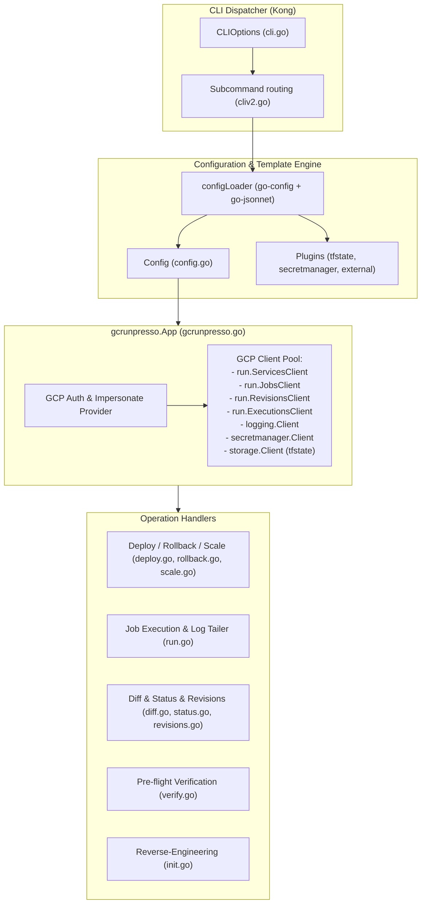

## Goal Capsule

- **Objective:** Fork `ecspresso` and transform the codebase into `gcrunpresso`, a dedicated Google Cloud Run management and deployment CLI tool supporting both Cloud Run Services and Cloud Run Jobs with an equivalent declarative workflow.
- **Product Authority:** Covers the CLI commands, configuration structure, and lifecycle operations for Cloud Run. Container image build/push, infrastructure provisioning (Terraform/Pulumi), and external IAM binding configurations (`setIamPolicy`) are upstream/surrounding concerns, not active CLI scope.
- **Stop Conditions:** All 13 CLI subcommands (`deploy`, `run`, `rollback`, `diff`, `init`, `status`, `revisions`, `executions`, `scale`, `wait`, `verify`, `render`, `delete`) implemented, unit-tested with mocked GCP API clients, and building cleanly without AWS SDK dependencies.
- **Open Blockers:** None.

---

## Product Contract

> **Product Contract Preservation:** All 28 Requirements (R1–R28), 6 Key Decisions (KD1–KD6), 3 Key Flows (F1–F3), and 4 Acceptance Examples (AE1–AE4) are carried forward from the brainstorm. The 2026-08-14 document review tightened wording in KD4/KD5/KD6, R5, R8, R9, R10, R13, R20, R24, R26, and F2 — no requirement was added, removed, or renumbered.

### Summary

`gcrunpresso` is a Go CLI tool for managing, deploying, and operating Google Cloud Run Services and Cloud Run Jobs declaratively. Using a configuration file (`gcrunpresso.yml`) alongside Cloud Run v2 API-compliant YAML/JSON definitions (`service.yaml` and `job.yaml`), it provides automated service deployment with traffic management, one-off batch execution with Cloud Logging streaming, instant rollback, configuration diffing, and resource verification.

### Problem Frame

Teams adopting Google Cloud Run face practical friction when managing application deployments:
- **Imperative CLI limits:** Raw `gcloud run deploy` commands rely on long flag lists that obscure configuration history and make version-controlled auditing error-prone.
- **gcloud replace limitations:** While `gcloud run services replace` supports declarative YAML, it lacks template rendering (environment variables, secret resolution, tfstate outputs), colorized pre-flight diffs, automated LRO/Condition health monitoring, real-time batch log streaming, and safe rollback mechanisms.
- **Heavyweight IaC:** Full Infrastructure as Code (Terraform / Pulumi) is essential for foundational networking and IAM, but introduces excessive latency and state locking when applied to frequent application deployments (e.g., updating container images or tweaking environment variables).
- **The ecspresso paradigm:** In AWS ECS, `ecspresso` successfully bridged this gap by combining declarative manifests with template evaluation, dynamic plugins, and operational subcommands (`deploy`, `run`, `rollback`, `diff`, `status`). `gcrunpresso` brings this proven operational pattern to Google Cloud Run.

### Key Decisions

- **KD1. Unified support for Services and Jobs:** Support both Cloud Run Services (HTTP/gRPC/WebSockets) and Cloud Run Jobs (one-off executions / DB migrations) within the single `gcrunpresso` CLI tool. *(session-settled: user-approved — chosen over Services-only: provides complete application lifecycle management)* Governs R1, R2, R6, R7, R11, R12, R13, R14.
- **KD2. Cloud Run Admin API v2 resource schema:** Base all definitions on the official Google Cloud Run API v2 schema (`cloud.google.com/go/run/apiv2/runpb`), preserving the single-manifest model where RevisionTemplate is embedded directly inside Service. *(session-settled: user-approved — chosen over Knative v1 or artificial file split: matches native GCP Go SDK types)* Governs R3, R4.
- **KD3. Immediate 100% traffic cutover with flexible canary and tagging flags:** Default to routing 100% traffic to the newly created Revision upon successful deployment, while providing `--tag`, `--no-traffic`, and custom traffic split options. *(session-settled: user-approved — chosen over rigid traffic enforcement)* Governs R5, R8, R9.
- **KD4. First-class GCP authentication and Service Account impersonation:** Integrate standard Application Default Credentials (ADC) while providing `--impersonate-service-account` and gcloud environment variable overrides. *(session-settled: user-approved — chosen over basic ADC-only: enables secure CI/CD impersonation without long-lived keys)* Governs R22, R23.
- **KD5. Native Secret Manager references over plaintext injection:** Prioritize Cloud Run's native `valueSource.secretKeyRef` in manifests to avoid plaintext credential leakage in diffs, CI logs, or state. The `secretmanager` plugin is reserved for non-container metadata lookups. *(session-settled: user-approved — chosen over template-time plaintext expansion)* Governs R24.
- **KD6. Coexistence with Terraform via clear ownership boundaries:** Define application manifests (`service.yaml` / `job.yaml`) as the authority for container images, environment variables, and traffic splits, while Terraform manages base service creation and IAM with `lifecycle { ignore_changes = [client, client_version, template[0].containers, template[0].scaling, traffic] }`. Every field written by any `gcrunpresso` subcommand must appear in this list — the container block is ignored wholesale (not just `containers[0].image`) so environment variables and sidecar containers are covered, and `template[0].scaling` is included because `scale` (R10) writes it. Governs R4, R5, R10, R24.

### Requirements

#### Core Configuration & CLI Interface

- R1. The CLI shall provide subcommands for Cloud Run management: `deploy`, `run`, `rollback`, `diff`, `init`, `status`, `revisions`, `executions`, `scale`, `wait`, `verify`, `render`, and `delete`.
- R2. The CLI shall read tool configuration from `gcrunpresso.yml` (or `.yaml`, `.json`, `.jsonnet`), specifying `project`, `location` (region), `service` (or `job`), `service_definition` (or `job_definition`), `plugins`, and `timeout`.
- R3. The CLI shall support Go template functions (`{{ env "VAR" }}`, `{{ must_env "VAR" }}`) and Jsonnet evaluation for dynamic configuration rendering.
- R4. The service definition (`service.yaml`) and job definition (`job.yaml`) shall adhere to the Google Cloud Run v2 Go SDK schema (`cloud.google.com/go/run/apiv2/runpb`).

#### Service & Job Deployment Lifecycle

- R5. The `deploy` command for Services shall apply the rendered service definition via `services.patch` (or `services.create`), trigger a new Revision, apply traffic allocation (100% to latest revision by default), and monitor the LRO and Service conditions until `Ready == True`.
  - **Update mask:** `deploy` shall patch only the manifest-owned field set (`template`, `traffic`, `labels`, `annotations`, `ingress`) via an explicit `update_mask`, and shall abort with an actionable error when `ingress`, `template.vpc_access`, or `template.service_account` is set on the remote Service but absent from the rendered manifest — otherwise a partial manifest silently resets those to API defaults (`INGRESS_TRAFFIC_ALL`, no VPC egress, default compute service account).
  - **Revision identity:** `deploy` shall set `template.revision` to a client-assigned deterministic Revision name so `--tag`, `--traffic`, and `rollback` can address the newly created Revision by name.
  - **Traffic composition:** a `deploy` with no traffic flags shall unconditionally re-assert 100% traffic to the newly created Revision, logging a warning when this overwrites a non-default traffic table (for example one pinned by a prior `rollback`).
  - **Timeout / interrupt:** on timeout or SIGINT, `deploy` shall pin the traffic table back to the Revision that was serving before the deploy started, print the name of the Revision it abandoned, and exit non-zero — so a slow-starting Revision that becomes `Ready` after the CLI gave up cannot take production traffic unattended.
- R6. The `deploy` command for Jobs shall apply the rendered job definition via `jobs.patch` (or `jobs.create`), updating task limits, template specs, or retries without triggering execution.
- R7. The `deploy` command shall support `--dry-run` to output the normalized API request payload and diff against remote state without modifying GCP resources.
- R8. The `deploy` command for Services shall support `--tag <name>` (assigning a revision tag accessible via tag URL), `--no-traffic` (deploying without routing base production traffic), and `--traffic <spec>` (explicit percentage split). `--traffic` shall use the grammar `<revision-name-or-tag>=<percent>`, with `latest` as the only reserved token, resolving to the Revision just created. `--no-traffic` shall read the existing traffic table via `services.get` and re-pin 100% to the current `latestReadyRevision` within the same patch, since an empty `traffic` list defaults to 100% LATEST.
- R9. The `rollback` command shall support two modes:
  - (Default Traffic Rollback): Re-route 100% traffic to the preceding healthy Revision (or `--revision <name>`) via a traffic-only update mask.
  - (Revert Template Rollback, `--revert-service`): Build an in-memory `runpb.RevisionTemplate` from the target Revision's materialized spec and deploy it. `service.yaml` is never rewritten — per R3 it is a Go template / Jsonnet source, so mechanically overwriting it would destroy the templating. `runpb.Revision` is a flat resource with no `template` field, so the conversion is an explicit field mapping; RevisionTemplate fields with no Revision counterpart (`healthCheckDisabled`, `revision`) are carried over from the current Service template rather than reset. The mode shall also reset the traffic table to 100% on the Revision it creates.
- R10. The `scale` command shall update `template.scaling.minInstanceCount` and/or `template.scaling.maxInstanceCount` — the `runpb.RevisionScaling` fields the manifest declares, **not** the service-level `Service.scaling` (`runpb.ServiceScaling`, which distributes a project-wide total across revisions by traffic percent) — using a targeted `update_mask` so unrelated template fields are not re-sent. Because the command mutates the RevisionTemplate, it necessarily creates a new Revision; `scale` shall route traffic to that Revision unless `--no-traffic` is passed.

#### Batch Execution & Operations

- R11. The `run` command shall execute a Cloud Run Job via `jobs.run`, stream container logs to stdout/stderr in real-time, and exit with the container's exit code.
- R12. The `run` command shall support runtime overrides for container args (`--override-args`), environment variables (`--override-env`), and task count (`--tasks`).
- R13. When multiple tasks are executed (`--tasks > 1`), `run` shall return the non-zero exit code of any failing task (or signal termination error). The exit code shall be read from `runpb.Task.lastAttemptResult.exitCode` via `run.TasksClient` — `runpb.Execution` carries only aggregate counters (`succeededCount`, `failedCount`, `cancelledCount`) and cannot supply it. When several tasks fail with different codes, `run` shall return the highest non-zero code; when the Execution failed but no Task reports an `exitCode` (for example `termSignal` is set instead), `run` shall return 1.
- R14. The `run` command shall stream logs via Cloud Logging `entries.tail`, automatically falling back to polling `entries.list` if the streaming quota (10 sessions/project) is saturated.
- R15. The `run` command shall support `--wait=false` to trigger the execution asynchronously and output the Execution resource name immediately.

#### Inspection, Validation & Reverse Engineering

- R16. The `diff` command shall render a colorized unified diff comparing local rendered definitions against remote state, ignoring server-managed output-only fields and default normalizations.
- R17. The `status` command shall display service readiness conditions, active traffic distribution, and latest revisions for Services, or recent execution results and job status for Jobs.
- R18. The `revisions` command shall list Revisions for a Service with creation dates, active traffic percentages, and serving state.
- R19. The `executions` command shall list recent Executions for a Job with completion status, task count, and duration.
- R20. The `verify` command shall perform pre-flight checks validating existence and access for referenced GCP Service Accounts, Artifact Registry container images, Secret Manager secrets, and VPC networks/connectors. When a `tfstate` backend is configured, `verify` shall additionally read it and emit an actionable warning if the target Cloud Run resource is Terraform-managed without the KD6 `ignore_changes` lifecycle block — otherwise the coexistence model's safety rests entirely on an unchecked user-side assumption and the next `terraform apply` silently reverts the deploy.
- R21. The `init` command shall inspect an existing Cloud Run Service or Job and generate `gcrunpresso.yml` and `service.yaml` / `job.yaml`, preserving `valueSource.secretKeyRef` references while alerting if plaintext credentials are found in environment variables.

#### GCP Authentication & Plugin Ecosystem

- R22. The tool shall authenticate using Google Cloud Application Default Credentials (ADC) and respect `GOOGLE_APPLICATION_CREDENTIALS`, `GOOGLE_CLOUD_PROJECT`, and `CLOUDSDK_COMPUTE_REGION`.
- R23. The CLI shall accept `--impersonate-service-account <email>` to execute operations with the identity of a designated Service Account.
- R24. The plugin system shall provide a `secretmanager` plugin that resolves secret *references* only — `{{ secretmanager_ref "<secret-id>" }}` returning a fully-qualified `projects/*/secrets/*/versions/*` resource name via metadata calls (`GetSecret` / `GetSecretVersion`) — and shall never call `AccessSecretVersion`, so no secret payload can reach a rendered manifest, a `render` / `diff` output, or a CI log. A `tfstate` plugin shall support GCS backends (`gs://...`).
- R25. The plugin system shall support the `external` plugin to execute external commands for dynamic template variable generation.

#### Lifecycle Utilities

- R26. The `wait` command shall poll a Service or Job until its `Ready` condition is `True` or a configurable timeout is exceeded, exiting non-zero and printing the observed condition on timeout or SIGINT.
- R27. The `render` command shall evaluate all templates, Jsonnet expressions, and plugins, writing the final evaluated YAML/JSON to stdout.
- R28. The `delete` command shall delete the specified Cloud Run Service or Job after interactive confirmation (bypassed with `--force`).

### Key Flows

- F1. **Service Deployment & Health Check:**
  - **Trigger:** Operator executes `gcrunpresso deploy`.
  - **Steps:**
    1. Load and evaluate `gcrunpresso.yml` and `service.yaml`.
    2. If `--dry-run`, perform diff against remote state, print request payload, and terminate.
    3. Check remote existence via `services.get`. Call `services.create` or `services.patch`.
    4. Apply traffic routing per `--tag` / `--traffic` / default 100% latest.
    5. Poll LRO and Service conditions until `Ready == True`.
  - **Covers:** R2, R3, R4, R5, R7, R8.

- F2. **Cloud Run Job Execution & Monitoring:**
  - **Trigger:** Operator executes `gcrunpresso run --override-args="--migrate"`.
  - **Steps:**
    1. Load Job configuration and merge CLI override flags.
    2. Invoke `jobs.run` to create an Execution.
    3. If `--wait=false`, print Execution ID and exit 0.
    4. Connect to Cloud Logging (`entries.tail` with `entries.list` fallback) matching the Execution ID.
    5. Await Execution completion, then list the Execution's Tasks and return the highest non-zero `lastAttemptResult.exitCode` across them (0 when every task succeeded, 1 when the Execution failed but no task reports an exit code).
  - **Covers:** R11, R12, R13, R14, R15.

- F3. **Revision Rollback & Traffic Cutover:**
  - **Trigger:** Operator executes `gcrunpresso rollback`.
  - **Steps:**
    1. Query `revisions.list` to identify the last healthy revision.
    2. Update Service traffic table to direct 100% traffic to that target Revision.
    3. If `--revert-service` is passed, update `service.yaml` template specification to restore declared state.
  - **Covers:** R9, R18.

### Acceptance Examples

- AE1. **Dry-Run Service Diff:**
  - **Given:** A local `service.yaml` with memory updated from `512Mi` to `1Gi`.
  - **When:** Running `gcrunpresso diff`.
  - **Then:** The command prints a unified diff highlighting `- memory: 512Mi` and `+ memory: 1Gi` and exits with code 0.
  - **Covers:** R7, R16.

- AE2. **Tagged Canary Deployment:**
  - **Given:** Production service receiving 100% traffic on revision `app-v1`.
  - **When:** Running `gcrunpresso deploy --tag preview --no-traffic`.
  - **Then:** A new revision `app-v2` is provisioned and tagged `preview` (accessible at `https://preview---<service>-<hash>.run.app`), while base production traffic remains 100% on `app-v1`.
  - **Covers:** R5, R8.

- AE3. **Failed Job Non-Zero Exit Code:**
  - **Given:** A Cloud Run Job container that fails with exit code `2`.
  - **When:** Running `gcrunpresso run`.
  - **Then:** Real-time container logs stream to stdout, and `gcrunpresso` exits with status code `2`.
  - **Covers:** R11, R13, R14.

- AE4. **Pre-flight Secret Verification:**
  - **Given:** A `service.yaml` referencing a non-existent Secret Manager secret `db-password-typo`.
  - **When:** Running `gcrunpresso verify`.
  - **Then:** Pre-flight checks detect the missing secret in Secret Manager, outputs an actionable error, and exits with code 1.
  - **Covers:** R20.

---

## Planning Contract

### Key Technical Decisions

- KTD1. **Protobuf-first manifest unmarshaling with `protojson` and `go-yaml`:** To maintain 100% schema alignment with GCP Cloud Run API v2, manifests in YAML/JSON will first be converted to canonical JSON via `goccy/go-yaml`, then unmarshaled into `*runpb.Service` or `*runpb.Job`. The `DiscardUnknown` option is split by direction: **local** `service.yaml` / `job.yaml` are unmarshaled with `protojson.UnmarshalOptions{DiscardUnknown: false}` so an unknown field surfaces as a load error naming the offending path, and **remote** API responses are decoded with `DiscardUnknown: true` so newer server-side fields do not break the client. Discarding unknown fields on local input would silently drop a mistyped key (`contaienrs:`) and deploy the resulting empty Service, and would silently accept a Knative `serving.knative.dev/v1` manifest — which is what `gcloud run services describe --format=yaml` emits — as a near-empty resource. *(session-settled: user-approved — chosen over custom struct mapping)* Governs R4, R16, R27.
- KTD2. **Dual-tier GCP client initialization (ADC + `impersonate`):** Initialize `google.golang.org/api/option` credential streams using standard ADC, and wrap with `google.golang.org/api/impersonate` token source when `--impersonate-service-account` or `impersonate_service_account` config is set. Governs R22, R23.
- KTD3. **Resource-polymorphic `App` struct with dedicated Service & Job controllers:** Structure `App` with `servicesClient *run.ServicesClient`, `jobsClient *run.JobsClient`, `executionsClient *run.ExecutionsClient`, `tasksClient *run.TasksClient`, `revisionsClient *run.RevisionsClient`, `logTailClient *logging.Client` (from `cloud.google.com/go/logging/apiv2`, the only package exposing `TailLogEntries`), and `logAdminClient *logadmin.Client` (from `cloud.google.com/go/logging/logadmin`, which owns `Entries` for the polling fallback). Note that `cloud.google.com/go/logging.Client` is the *write*-side client and exposes no entry-reading API, so it is not used here. `tasksClient` is required because exit codes live on `runpb.Task.lastAttemptResult`, not on `runpb.Execution`. Governs R1, R2, R13.
- KTD4. **Resilient two-tier log streaming engine:** Attempt gRPC streaming via `loggingpb.LoggingServiceV2_TailLogEntriesClient` (`entries.tail`); if gRPC stream setup encounters RESOURCE_EXHAUSTED (exceeding 10 concurrent streams) or is unavailable, seamlessly fall back to time-windowed polling via `logAdminClient.Entries` with duplicate suppression. Once the Execution reaches a terminal state, both paths continue querying for a bounded drain window (default 30s, configurable) before exiting — Cloud Logging ingestion lags the Execution status, so exiting immediately on `GetExecution` completion would drop exactly the final lines a failing container wrote. Governs R11, R14.
- KTD5. **Normalized Diff Engine with server-default suppression:** Before executing diffs, normalize protobuf JSON by stripping server-managed output fields (`uid`, `generation`, `createTime`, `updateTime`, `deleteTime`, `expireTime`, `creator`, `lastModifier`, `observedGeneration`, `reconciling`, `etag`, `terminalCondition`, `conditions`, `urls`, `uri`, `latestReadyRevision`, `latestCreatedRevision`, `trafficStatuses`, `satisfiesPzs`, `threatDetectionEnabled`) and normal default values (e.g. `maxInstanceCount: 100` if unspecified). Four of these (`latestReadyRevision`, `latestCreatedRevision`, `trafficStatuses`, `lastModifier`) change on every deploy, so omitting them makes every diff noisy. The same strip list governs `init` output (U8), otherwise a generated `service.yaml` carries fields the API rejects on create. Governs R7, R16, R21.
- KTD6. **Context-aware LRO and Condition Poller:** Replace AWS ECS waiter polling with a generic `waitOperation[T any]` helper in `wait.go`, parameterised over an interface providing `Done() bool`, `Name() string`, and `Wait(context.Context) (T, error)`. `cloud.google.com/go/run/apiv2` exposes no single `run.Operation` type — the helper must cover the per-method structs `run.CreateServiceOperation`, `run.UpdateServiceOperation`, `run.CreateJobOperation`, `run.UpdateJobOperation`, and `run.RunJobOperation`. Combine with Service/Job Condition `Ready` checks, bounded by `App.Timeout()` and graceful SIGINT cancellation. On timeout or SIGINT the caller pins the traffic table back to the previously serving Revision, prints the abandoned Revision name, and exits non-zero (see R5). Governs R5, R26.

### High-Level Technical Design



#### Package & File Organization

```text
gcrunpresso/
├── cmd/
│   └── gcrunpresso/
│       └── main.go          # Binary entry point
├── cli.go                   # Kong CLI struct definitions & options
├── cliv2.go                 # Subcommand parser & app dispatcher
├── config.go                # Config loading, template expansion, defaults
├── json.go                  # protojson serializers with output-only suppression
├── jsonnet.go               # Jsonnet evaluation & native function registration
├── gcrunpresso.go           # App struct, GCP client initializations, helpers
├── deploy.go                # Service & Job deploy, traffic management, LRO wait
├── run.go                   # Job execution, override merging, log tailing
├── rollback.go              # Revision traffic rollback & template revert
├── scale.go                 # Min/max instance count scaling via update_mask
├── status.go                # Service/Job readiness, conditions & URLs
├── revisions.go             # Revisions listing & traffic inspection
├── executions.go            # Job Execution history & task status
├── diff.go                  # Normalized unified diff engine
├── init.go                  # Reverse-engineering remote Service/Job to local YAML
├── verify.go                # Pre-flight resource checks (IAM, Secret, Artifact Registry)
├── wait.go                  # Health/Readiness polling helpers
├── render.go                # Pure template & Jsonnet evaluation to stdout
├── delete.go                # Service & Job deletion
├── plugin.go                # Plugins: tfstate (GCS), secretmanager, external
├── logger.go                # slog handler & formatted outputs
└── util.go                  # String/proto converters, diff formatters
```

### Assumptions & Implementation Constraints

- Go 1.22+ runtime using official `cloud.google.com/go` SDK modules.
- The Cloud Run Admin API v2 (`run.googleapis.com`) must be enabled on the target GCP Project.
- Service account executing `gcrunpresso` requires `roles/run.developer` and `roles/iam.serviceAccountUser`, plus `roles/logging.viewer` for logs, `roles/secretmanager.viewer` for verify (existence check only — `gcrunpresso` never requires `secretmanager.versions.access`, so no identity it runs under can read secret payloads), `roles/artifactregistry.reader` for image verification, and `roles/compute.networkViewer` for VPC connector/network verification.
- Terraform users adopt `lifecycle { ignore_changes = [...] }` for application deployment fields to prevent state drift overwrite.

### Risks & Mitigations

- **Risk: Cloud Logging `entries.tail` stream limits (10 concurrent streams per project).**
  - *Mitigation:* Implemented KTD4 with automatic fallback to polling `entries.list` on stream rejection, ensuring zero CI/CD build failures due to log quota saturation.
- **Risk: Spurious diff noise from server-generated output fields.**
  - *Mitigation:* Explicit proto normalization filter (KTD5) strips non-configurable metadata before running Myers unified diff.
- **Risk: Breaking changes from old ecspresso AWS SDK references.**
  - *Mitigation:* Completely purge AWS SDK v2 from `go.mod` in Unit 1 and migrate to a standalone Go module name `github.com/kayac/gcrunpresso`.

---

## Implementation Units

### U1. Go Module Migration & Dependency Overhaul

- **Goal:** Transform repository module definition to `github.com/kayac/gcrunpresso`, remove all AWS SDK v2 dependencies and the ECS-only source files that depend on them, introduce Google Cloud Go SDKs, and rename every distribution surface.
- **Requirements:** R1, R4, R22.
- **Files:**
  - `go.mod`
  - `go.sum`
  - `cmd/gcrunpresso/main.go`
  - `Makefile`
  - `action.yml`
  - `orb.yml`
  - `Dockerfile`
  - `.github/workflows/`
  - **Delete (ECS-only, no Cloud Run analog):** `appspec.go`, `autoscaling.go`, `create.go`, `deregister.go`, `exec.go`, `express.go`, `refresh.go`, `register.go`, `tasks.go`, `format.go`, `output.go`, `docs.go`, `docs_embed.go`, `skills.go`, `envfile.go`, `ecspresso.go`, and their `_test.go` peers, plus the `appspec/`, `registry/` (ECR), and `secretsmanager/` (AWS) subpackages.
- **Approach:**
  - Update module path to `github.com/kayac/gcrunpresso`.
  - Remove all `github.com/aws/aws-sdk-go-v2` dependencies.
  - Delete the ECS-only files listed above **and** their Kong subcommand registrations in `cli.go` / `cliv2.go` (`Appspec`, `Deregister`, `Exec`, `Refresh`, `Register`, `Tasks`, `Skills`). Note that `exec.go` wires the `ecsta`-based interactive exec / port-forward / cp subcommand — the interactive-container-exec capability the Product Contract deferred — so its removal is required, not optional.
  - Add `cloud.google.com/go/run/apiv2`, `cloud.google.com/go/run/apiv2/runpb`, `cloud.google.com/go/logging/apiv2`, `cloud.google.com/go/logging/logadmin`, `cloud.google.com/go/secretmanager/apiv1`, `cloud.google.com/go/artifactregistry/apiv1`, `google.golang.org/api` (including `google.golang.org/api/impersonate`), `google.golang.org/protobuf`.
  - Rename every `ecspresso` reference to `gcrunpresso` in `Makefile`, `action.yml` (which currently downloads a binary named `ecspresso`), `orb.yml` (described as "orb for ecspresso"), `Dockerfile` (`ENTRYPOINT /usr/local/bin/ecspresso`), and the release workflows.
  - Confirm `github.com/fujiwara/tfstate-lookup` stays on a build that includes GCS support — its GCS backend sits behind a `!no_gcs` build tag, so the release Makefile must not pass `-tags no_gcs`.
- **Test Scenarios:**
  - `grep -r aws-sdk-go-v2 --include='*.go' .` returns nothing.
  - `grep -ri ecspresso action.yml orb.yml Dockerfile Makefile` returns nothing.
  - `go build ./cmd/gcrunpresso` compiles the binary entrypoint.
- **Verification:** `go build -o gcrunpresso ./cmd/gcrunpresso && ./gcrunpresso version` outputs version info. **Note:** whether this gate is reachable at the end of U1 depends on the unit-sequencing question recorded under "Deferred / Open Questions" — 29 of the repository's 57 root `.go` files import the AWS SDK from a single flat package, so the build cannot succeed until every dependent file is deleted or rewritten.

---

### U2. Configuration Engine & Manifest Model

- **Goal:** Implement GCP-native `Config` and protobuf-compatible manifest loaders supporting YAML, JSON, Jsonnet, and template expansions.
- **Requirements:** R2, R3, R4, R27.
- **Files:**
  - `config.go`
  - `config_test.go`
  - `json.go`
  - `jsonnet.go`
- **Approach:**
  - Update `Config` struct fields: `Project`, `Location` (region), `Service`, `Job`, `ServiceDefinitionPath`, `JobDefinitionPath`, `Plugins`, `Timeout`.
  - Implement `LoadServiceDefinition(path)` and `LoadJobDefinition(path)` returning `*runpb.Service` and `*runpb.Job` via YAML-to-JSON -> `protojson.Unmarshal` with `DiscardUnknown: false`, surfacing an unknown field as a load error that names the offending field path (per KTD1).
  - Evaluate Jsonnet in `jsonnet.go` via `go-jsonnet` *before* the YAML-to-JSON conversion: register the plugin native functions (`tfstate`, `secretmanager_ref`, `external`) as Jsonnet natives and the Go template functions (`env`, `must_env`) as template funcs, so both rendering paths feed the same canonical JSON that protojson consumes.
  - Provide fallback environment variable discovery for `Project` (`GOOGLE_CLOUD_PROJECT`, `CLOUDSDK_CORE_PROJECT`) and `Location` (`CLOUDSDK_COMPUTE_REGION`).
- **Test Scenarios:**
  - Load valid `gcrunpresso.yml` with `service.yaml` and verify template variable expansion (`{{ env "FOO" "default" }}`).
  - Load Jsonnet configuration file with external variables and native functions.
  - Verify error handling on invalid YAML syntax or missing required environment variables (`must_env`).
  - A `service.yaml` containing a misspelled key (`contaienrs:`, `maxInstanceCout:`) is rejected with an error naming the field path, not silently loaded as an empty Service.
  - A Knative `serving.knative.dev/v1` manifest is rejected with an actionable message pointing at the v2 schema.
- **Verification:** `go test -v -run TestConfig ./...` passes.

---

### U3. App Core & GCP Authentication Lifecycle

- **Goal:** Implement the central `App` struct managing GCP client connections, Application Default Credentials (ADC), and Service Account impersonation.
- **Requirements:** R2, R22, R23.
- **Files:**
  - `gcrunpresso.go`
  - `gcrunpresso_test.go`
  - `cli.go`
  - `cliv2.go`
- **Approach:**
  - Implement `New(ctx, opt)` in `gcrunpresso.go` setting up ADC via `option.WithCredentials`, or wrapping `impersonate.CredentialsTokenSource` and passing it through `option.WithTokenSource` when `--impersonate-service-account` is set.
  - Instantiate `run.NewServicesClient`, `run.NewJobsClient`, `run.NewRevisionsClient`, `run.NewExecutionsClient`, `run.NewTasksClient`, `logging.NewClient` from `cloud.google.com/go/logging/apiv2` (for `TailLogEntries`), and `logadmin.NewClient` (for the `Entries` polling fallback) — per KTD3.
  - Update Kong CLI options in `cli.go` (`--project`, `--location`, `--impersonate-service-account`, `--config`).
- **Test Scenarios:**
  - Initialize `App` with mock credentials and verify client construction.
  - Verify CLI flags correctly override `gcrunpresso.yml` settings.
- **Verification:** `go test -v -run TestAppInit ./...` passes.

---

### U4. Service Deployment & Traffic Management

- **Goal:** Implement `deploy`, `rollback`, `scale`, and `wait` subcommands for Cloud Run Services with condition-based health polling.
- **Requirements:** R5, R7, R8, R9, R10, R26.
- **Files:**
  - `deploy.go`
  - `deploy_test.go`
  - `rollback.go`
  - `scale.go`
  - `wait.go`
  - `wait_test.go`
- **Approach:**
  - `Deploy`: Check `ServicesClient.GetService`. If missing, `CreateService`; otherwise `UpdateService` (`services.patch`) with an explicit `update_mask` covering only the manifest-owned fields (`template`, `traffic`, `labels`, `annotations`, `ingress`). Abort with an actionable error when `ingress`, `template.vpc_access`, or `template.service_account` exists remotely but is absent from the rendered manifest, so a partial manifest cannot silently make an internal service public.
  - Set `template.revision` to a client-assigned deterministic Revision name derived from the Service's `latestCreatedRevision`, so the new Revision is addressable by name for `--tag`, `--traffic`, and `rollback`.
  - Apply traffic allocation: with no flags, re-assert 100% to the newly created Revision and log a warning if this overwrites a non-default traffic table. `--no-traffic` reads the current table via `GetService` and re-pins 100% to `latestReadyRevision` in the same patch. `--traffic` parses `<revision-name-or-tag>=<percent>` with `latest` as the only reserved token.
  - Poll the operation and Service conditions until `Ready == True` using the generic `waitOperation` helper (KTD6). On timeout or SIGINT, pin traffic back to the previously serving Revision, print the abandoned Revision name, and exit non-zero.
  - `Wait`: reuse the same `waitOperation` + Condition poller against an existing Service or Job without mutating it (R26).
  - `Rollback`: List revisions with `RevisionsClient.ListRevisions`, find the preceding ready revision, and update Service `traffic` with field mask `traffic`. With `--revert-service`, build a `runpb.RevisionTemplate` from the target Revision via an explicit field-mapping table in `rollback.go` — documenting which RevisionTemplate fields (`healthCheckDisabled`, `revision`) have no Revision source and are therefore carried over from the current Service template rather than reset — deploy it, and reset traffic to 100% on the resulting Revision. Never rewrite `service.yaml`.
  - `Scale`: Send `UpdateServiceRequest` with `update_mask: "template.scaling.min_instance_count,template.scaling.max_instance_count"`, carrying the remote template forward otherwise. This targets `runpb.RevisionScaling` (what the manifest declares), not the service-level `runpb.ServiceScaling`, and therefore creates a new Revision by design.
- **Test Scenarios:**
  - Test `deploy --dry-run` outputs the planned protobuf payload without calling mutate APIs.
  - Test traffic splitting with `--tag` and `--traffic="latest=10,app-v1=90"` (revision addressed by name — there is no symbolic `prev` in `runpb.TrafficTarget`).
  - Test `deploy` aborts when the remote Service has `ingress: INGRESS_TRAFFIC_INTERNAL_ONLY` and the rendered manifest omits `ingress`.
  - Test `deploy` with no traffic flags warns and overwrites a traffic table previously pinned by `rollback`.
  - Test `rollback` identifies the correct previous revision and issues traffic update; test `--revert-service` carries over the fields with no Revision source instead of zeroing them.
  - Test `scale` sends only the two `template.scaling.*` paths in the update mask.
  - Test deploy timeout re-pins traffic to the previously serving Revision and exits non-zero.
- **Verification:** `go test -v -run 'TestDeploy.*|TestRollback.*|TestScale.*|TestWait.*' ./...` passes.

---

### U5. Job Execution & Resilient Log Streaming

- **Goal:** Implement Cloud Run Job deployment (`deploy --job`), execution (`run`), runtime overrides, and resilient Cloud Logging streaming.
- **Requirements:** R6, R11, R12, R13, R14, R15.
- **Files:**
  - `run.go`
  - `run_test.go`
  - `executions.go`
- **Approach:**
  - Support `deploy` for Jobs via `JobsClient.UpdateJob` / `CreateJob`.
  - `Run`: Invoke `JobsClient.RunJob` with `Overrides` (`ContainerOverrides` for args/env, `TaskCount`).
  - If `--wait=false`, print Execution resource name and exit.
  - Log Streaming: Connect to `entries.tail` with filter `resource.type="cloud_run_job" AND resource.labels.job_name="<job>" AND labels."run.googleapis.com/execution_name"="<exec>"`.
  - Fall back to periodic `logAdminClient.Entries` polling if streaming is saturated (RESOURCE_EXHAUSTED at 10 concurrent streams per project) or unavailable.
  - After the Execution reaches a terminal state, keep reading for a bounded drain window (default 30s, configurable) on both the tail and polling paths before exiting, so Cloud Logging ingestion lag does not truncate the failing container's final lines.
  - Await Execution completion via `ExecutionsClient.GetExecution`, then derive the exit status from `TasksClient.ListTasks` scoped to that Execution, reading `Task.LastAttemptResult.ExitCode` — `runpb.Execution` carries only aggregate counters. Return the highest non-zero code across tasks, or 1 when the Execution failed but no task reports an exit code (e.g. `termSignal` is set).
- **Test Scenarios:**
  - Verify container args and env overrides are correctly mapped to `runpb.RunJobRequest_Overrides`.
  - Test log filter formatting, and exit-code extraction from `Task.LastAttemptResult` for a single-task Execution.
  - Test multi-task aggregation: tasks exiting 0, 2, and 3 yield CLI exit code 3; a task with only `termSignal` yields 1.
  - Test the polling fallback engages on RESOURCE_EXHAUSTED and that the drain window emits log lines ingested after the Execution reported completion.
- **Verification:** `go test -v -run TestRun.* ./...` passes.

---

### U6. Inspection & Diffing Engine

- **Goal:** Implement `diff`, `status`, `revisions`, and `executions` commands providing clear terminal observability.
- **Requirements:** R14, R16, R17, R18, R19.
- **Files:**
  - `diff.go`
  - `diff_test.go`
  - `status.go`
  - `revisions.go`
  - `executions.go`
- **Approach:**
  - `Diff`: Fetch remote Service/Job, normalize both local and remote objects (stripping server output-only fields per KTD5), and run colorized Myers unified diff (`hexops/gotextdiff`).
  - `Status`: Format Service URI, conditions (`Ready`, `ConfigurationsReady`, `RoutesReady`), and active traffic distribution.
  - `Revisions`: Output table of revisions with creation timestamp, serving status, and traffic %.
  - `Executions`: Output table of recent job executions with task counts and completion states.
- **Test Scenarios:**
  - Verify diff correctly flags container image changes while ignoring server-generated `uid` and `etag`.
  - Verify table formatter outputs clean ASCII/ANSI tables for revisions and status.
- **Verification:** `go test -v -run TestDiff.* ./...` passes.

---

### U7. Resource Verification & Template Plugins

- **Goal:** Implement pre-flight resource checks (`verify`) and GCP template plugins (`secretmanager`, `tfstate` with GCS, `external`).
- **Requirements:** R20, R24, R25.
- **Files:**
  - `verify.go`
  - `verify_test.go`
  - `plugin.go`
- **Approach:**
  - `Verify`: Inspect `service.yaml` / `job.yaml` and validate referenced resources:
    - Service Account permissions via IAM API.
    - Secret Manager secrets existence via `secretmanager.GetSecret` (metadata only — never `AccessSecretVersion`).
    - Artifact Registry images existence via registry check or `artifactregistry.GetDockerImage`.
    - VPC egress: any referenced `template.vpc_access` connector or `network_interfaces` network/subnetwork exists and is reachable in the configured project, via the VPC Access / Compute API. Without this, a green `verify` is read as "the egress boundary was checked" when it never was.
    - Terraform ownership: when a `tfstate` backend is configured, read it and warn if the target Cloud Run resource is Terraform-managed without KD6's `ignore_changes` lifecycle block.
  - Plugins:
    - `secretmanager`: reference-only Go template function `{{ secretmanager_ref "<secret-id>" }}` returning a fully-qualified `projects/*/secrets/*/versions/*` resource name via `GetSecret` / `GetSecretVersion`, for use in Cloud Run's native `valueSource.secretKeyRef` (KD5). No unit calls `AccessSecretVersion`; secret payloads never enter a rendered manifest, `render` / `diff` output, or a CI log.
    - `tfstate`: GCS backend lookup `{{ tfstate "google_cloud_run_v2_service.default.uri" }}` via `fujiwara/tfstate-lookup`.
    - `external`: Execute shell command for dynamic variables.
- **Test Scenarios:**
  - Verify the `secretmanager` plugin returns a secret version resource name and never invokes `AccessSecretVersion` on the mock.
  - Verify `verify` catches non-existent secret references.
  - Verify `verify` catches a missing VPC connector.
  - Verify `verify` warns on a Terraform-managed Service whose state lacks the KD6 `ignore_changes` guard.
- **Verification:** `go test -v -run TestVerify.* ./...` passes.

---

### U8. Reverse Engineering & Lifecycle Utilities

- **Goal:** Implement `init` (reverse-engineering remote resources to local files), `render`, and `delete`. (`wait` / R26 is implemented in U4, which already owns `wait.go` and the KTD6 poller.)
- **Requirements:** R21, R27, R28.
- **Files:**
  - `init.go`
  - `init_test.go`
  - `render.go`
  - `delete.go`
- **Approach:**
  - `Init`: Call `ServicesClient.GetService` or `JobsClient.GetJob`, strip output-only fields using the same KTD5 list the diff engine applies, format to clean YAML, and generate `gcrunpresso.yml` and `service.yaml` / `job.yaml`.
  - `Init` security handling (R21): copy `EnvVar.ValueSource.SecretKeyRef` entries through verbatim, and emit a `LogWarn` naming each env var that carries an inline `value` whose key matches credential heuristics (`PASSWORD|SECRET|TOKEN|KEY|CREDENTIAL|API`). Without this, `init` against a live service writes production credentials into a file the GitOps workflow then commits.
  - `Render`: Output fully evaluated manifest to stdout (supporting `--format=yaml/json`).
  - `Delete`: Call `DeleteService` or `DeleteJob` after interactive confirmation, bypassed with `--force` (R28).
- **Test Scenarios:**
  - Test `init` converts live `runpb.Service` into valid `service.yaml` and `gcrunpresso.yml`.
  - Test `init` round-trips a `secretKeyRef` entry unchanged and warns for a plaintext env var named `DB_PASSWORD`.
  - Test `render` prints valid YAML to stdout.
  - Test `delete` prompts without `--force` and skips the prompt with it.
- **Verification:** `go test -v -run 'TestInit.*|TestRender.*|TestDelete.*' ./...` passes.

---

## Verification Contract

### Automated Tests

- **Unit Tests:** Run all unit tests across configuration, manifest parsing, diff normalization, and CLI dispatch:
  ```bash
  go test -v -race ./...
  ```
- **Code Quality & Linting:**
  ```bash
  go fmt ./... && go vet ./...
  ```
- **Binary Compilation & Smoke Check:**
  ```bash
  go build -o bin/gcrunpresso ./cmd/gcrunpresso
  ./bin/gcrunpresso --help
  ./bin/gcrunpresso version
  ```

### Manual & Integration Verification

- **Dry-Run Validation:** Run `./bin/gcrunpresso deploy --dry-run` against sample `gcrunpresso.yml` and `service.yaml` to confirm normalized API payloads.
- **Render Validation:** Execute `./bin/gcrunpresso render` with environment variables to ensure zero template leaks.

### Acceptance Verification

Every check above stops at compilation, mocked unit tests, and `--dry-run`, so the suite can pass without the tool ever having deployed to Cloud Run. These four checks run against a scratch GCP project and map one-to-one onto the Product Contract's Acceptance Examples:

- **AE1 — Diff:** Change `memory` from `512Mi` to `1Gi` in `service.yaml`, run `gcrunpresso diff`, and confirm the output shows exactly that one change (no `latestReadyRevision` / `trafficStatuses` churn) and exits 0.
- **AE2 — Tagged canary:** With production at 100% on `app-v1`, run `gcrunpresso deploy --tag preview --no-traffic`, then confirm via `gcrunpresso revisions` that base traffic is still 100% on `app-v1` and the tagged Revision is reachable at its tag URL.
- **AE3 — Job exit code:** Run a Cloud Run Job whose container exits 2, confirm container logs reach stdout including the final lines, and confirm `gcrunpresso run` exits 2.
- **AE4 — Missing secret:** Point `service.yaml` at a non-existent Secret Manager secret, run `gcrunpresso verify`, and confirm it names the missing secret and exits 1.

---

## Definition of Done

1. **Clean Codebase:** Zero remaining references to AWS SDK (`github.com/aws/aws-sdk-go-v2`), AWS ECS, CodeDeploy, or CloudWatch Logs.
2. **Full Command Suite:** All 13 subcommands (`deploy`, `run`, `rollback`, `diff`, `init`, `status`, `revisions`, `executions`, `scale`, `wait`, `verify`, `render`, `delete`) implemented and verified.
3. **Passing Tests:** 100% of unit tests in `./...` pass with race detection enabled.
4. **Documentation & Distribution Alignment:** `README.md` updated with GCP Cloud Run quickstart, configuration guide, and command references, **and** every distribution surface renamed and re-pointed — the GitHub Action (`action.yml`), the CircleCI orb (`orb.yml`), the `Dockerfile` entrypoint, and the release workflows. A release that satisfies items 1-3 while shipping an Action that downloads a binary named `ecspresso` is not done.
5. **Acceptance Verified:** All four checks in the Verification Contract's Acceptance Verification subsection pass against a real Cloud Run project.

---

## Resolved Decisions & Milestones

### Unit Sequencing & Cleanup (Settled)
- **Resolution:** Adopted Option (a) Clean-sweep in Unit 1. U1 removes all AWS SDK references, deletes ECS-only source files, updates module to `github.com/kayac/gcrunpresso`, and establishes minimal compiling stubs for remaining subcommands so that `go build` and `go test` compile cleanly from Unit 1 onward.

### Phased Milestones (Settled)
- **Milestone 1 (Services Core):** U1 (Base/Module), U2 (Config/Manifests), U3 (App/Auth), U4 (Service Deploy/Rollback/Scale/Wait), U6 (Diff/Status/Revisions), U8 (Render/Delete). Enables full deployment, diff, status, and rollback loop for Cloud Run Services.
- **Milestone 2 (Jobs, Plugins & Tooling):** U5 (Job Deploy/Run/Log Streaming/Executions), U7 (Pre-flight Verify & Plugins), U8 (Init reverse-engineering). Adds batch execution, verification, and reverse engineering.

